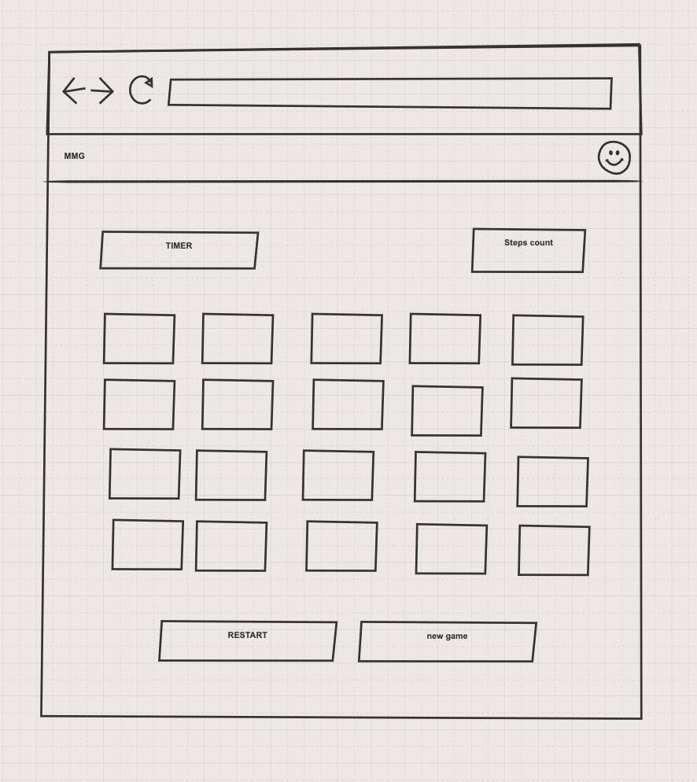

# Game page

## Requirements:
1. Size of grid must be equal with size which user select in welcome page.
2. The sorting of cards should be random.
3. When user enter the page timer started.
4. User click to some card: 
   * if its first card: just open the card
   * if its second card
      * open the card
      * increment steps count  +1
      * if card matched: hide this cards
      * not matched: flip cards back
5. Game finish when user matched all pairs. Game finish and user redirect to `congratulation` page and data about results must be saved to records table on **local-storage**
6. If user click `Restart` button:
   * cards shuffle
   * steps counter reset to 0
   * timer restart
7. When user click `new game` button redirect user to Welcome page 

---

Example of UI:

