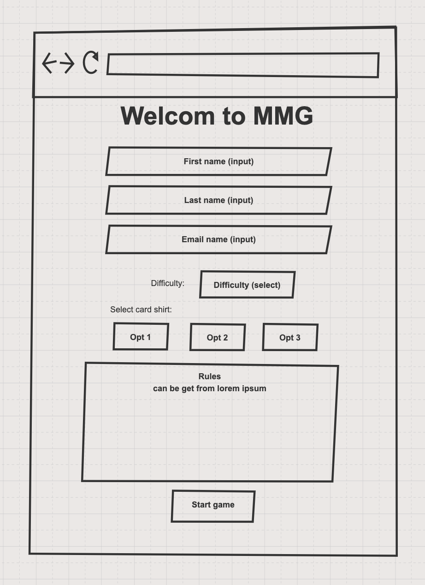
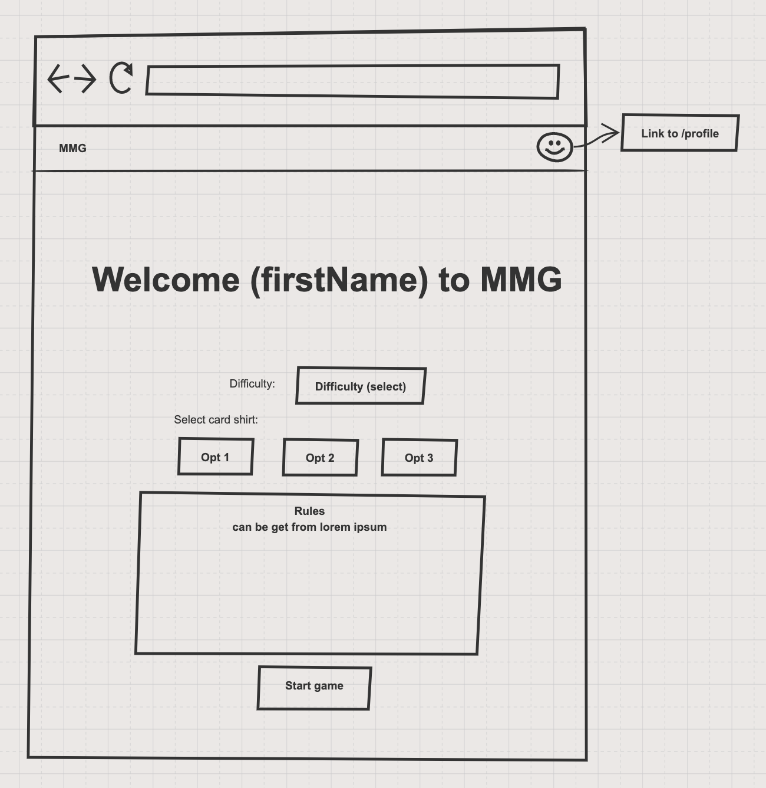

# Welcome page

## Requirements:
1) first name, last name - text input
2) email - input with email validation
3) difficulty - select with **3** options:
   * easy (5 colums x 4 rows) 
   * medium ( 6x6 )
   * hard ( 8x8 )
4) Card shirt - at least **three** type of shirt
5) Rules - can be [lorem ipsum](https://www.lipsum.com/) text  
6) when user click Start game:
   * profile data saved to local storage 
   * user moved to `/game` page
7) If local storage has data about user profile, welcome page must looks like the second image bellow
  
Profile data:
* first name
* last name
* email
  
---

## When user enter game first time:

## Next time welcome page:
