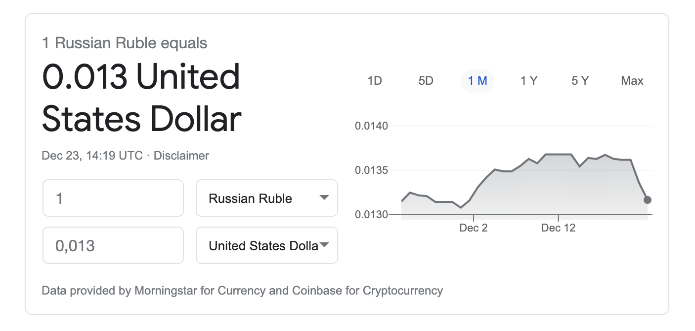

# Currency exchange component

Implement component where user can convert one currency to another

## Requirements
  
* Example of UI see at the end of file
* Your component must convert at least EUR, USD, BYN
* For basic components use [antd](https://ant.design/components/overview/) library
* For get data you can try use [this api](https://fixer.io/documentation) ([one more api](https://exchangeratesapi.io/)) or use json file with hardcoded data 

## Advance requirements
* Implement charts with [g2plot](https://g2plot.antv.vision/en/docs/manual/getting-started) or some other chart library which your want
  
## The example of component:  

