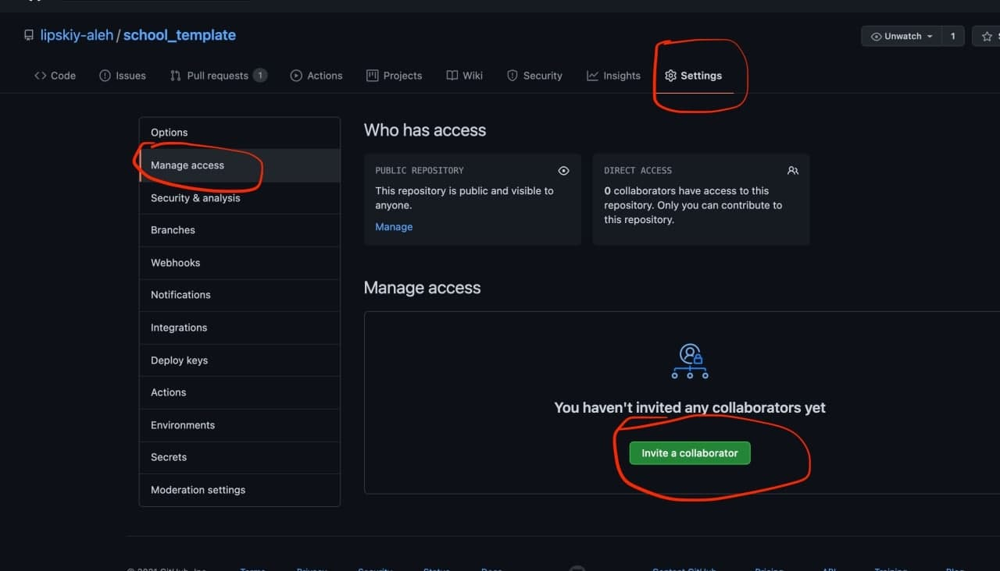
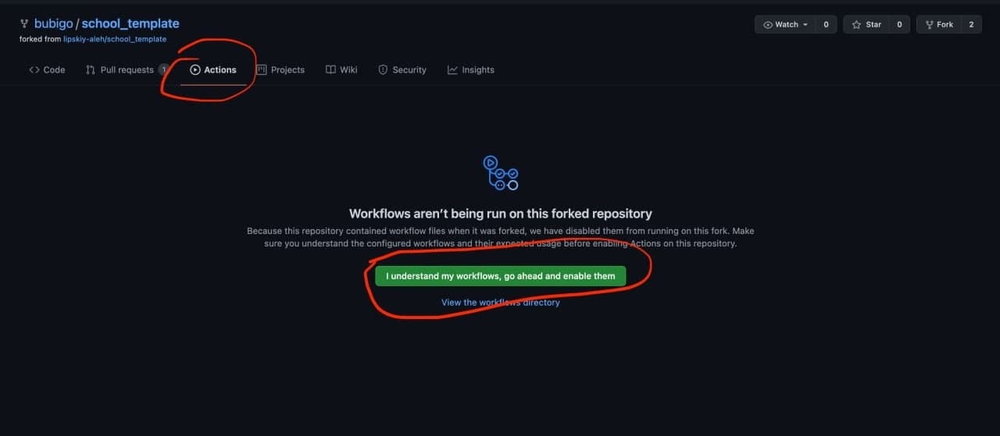

# First HW

## Steps:
1) Fork [repository](https://github.com/lipskiy-aleh/school_template)
  * Add your mentor as collaborator (settings -> manage access -> invite a collaborator)
  
  * Activate actions in your new repository
  
2) Crate branch `task-git`
3) Add information about yourself to Readme.md
4) Create pull request
5) Send link to mentor