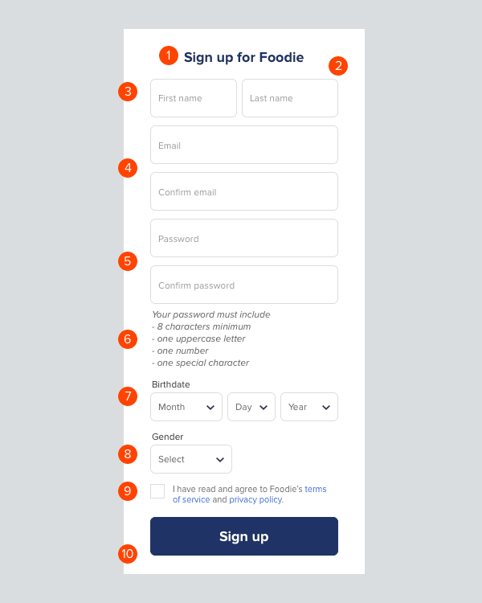

# Styles and UI library

## Description

* Init react app
* Create SignUp form with next requirements:  

  
  4 - Email inputs, should have validation if values in input not equal, user should see error
  5 - Password input, password should match with all rules(6) when some rule matched, this rule become green, if values in "password" and "confirm password" inputs not equal, user should see error
  7 - Birthday, you can use datepicker from Antd instead of three selectors. validation should check that user 18+ years old
  8 - Gender selector with three options Male, Female, Other
  10 - Sign up button should be disabled if user not check "I have read and agree Terms and Conditions" and/or any of inputs highlights with error 