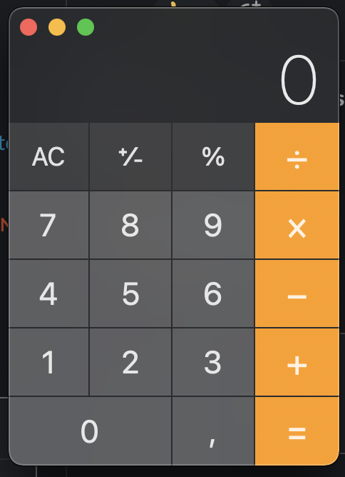

# Vacation TODO

## Theory
* Done [redux](https://egghead.io/courses/getting-started-with-redux) course
* Read about iterator, generator
  * [Learn javascript, 2 topics](https://javascript.info/generators-iterators), ([RU](https://learn.javascript.ru/generators-iterators))
  * [Article](https://nickbulljs.medium.com/%D0%B7%D0%B0%D1%87%D0%B5%D0%BC-%D0%BE%D0%BD%D0%B8-%D0%BD%D1%83%D0%B6%D0%BD%D1%8B-%D0%B2-javascript-symbol-iterator-generator-d5d186b4f1bd)
* Fork [this](https://github.com/lipskiy-aleh/organization-helper) repository, take a look and try to understand UI part, next step help you with understanding redux middleware (redux-saga). (We will work with this project after New Year)
* Try to understand [redux-saga](https://redux-saga.js.org/) middleware for redux. [Resources for learning](https://redux-saga.js.org/docs/ExternalResources.html)

## Practice
* Try to implement base calculator with React
